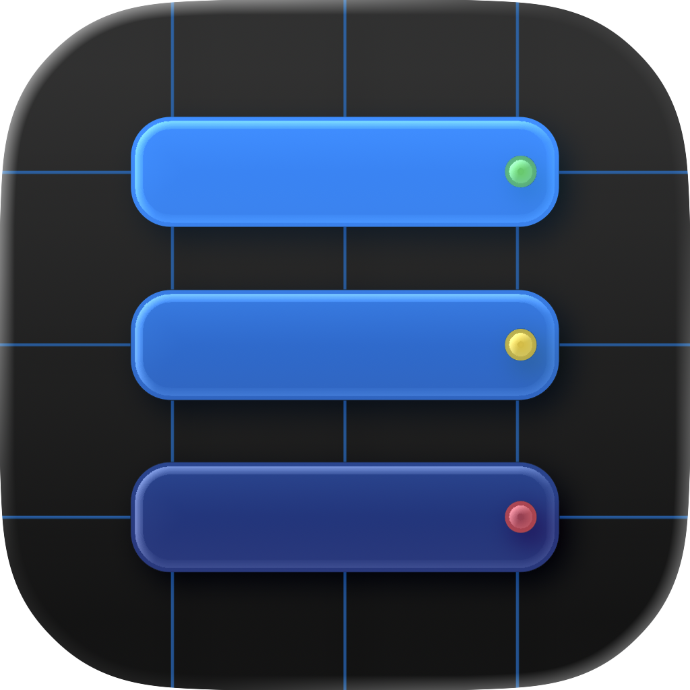
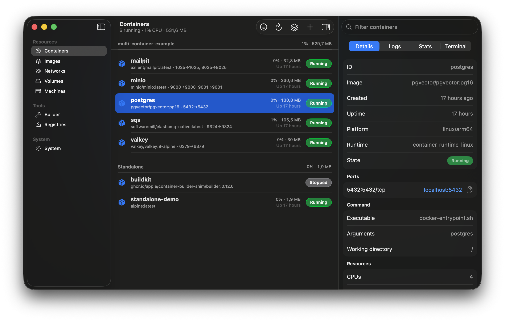
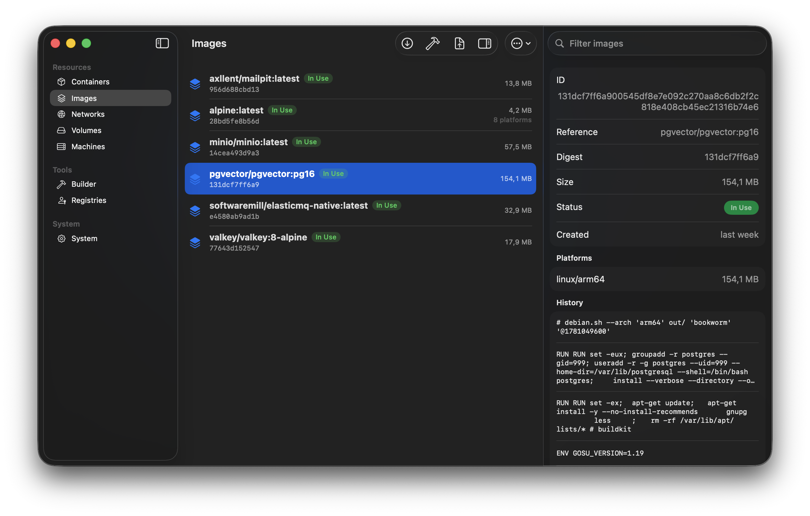
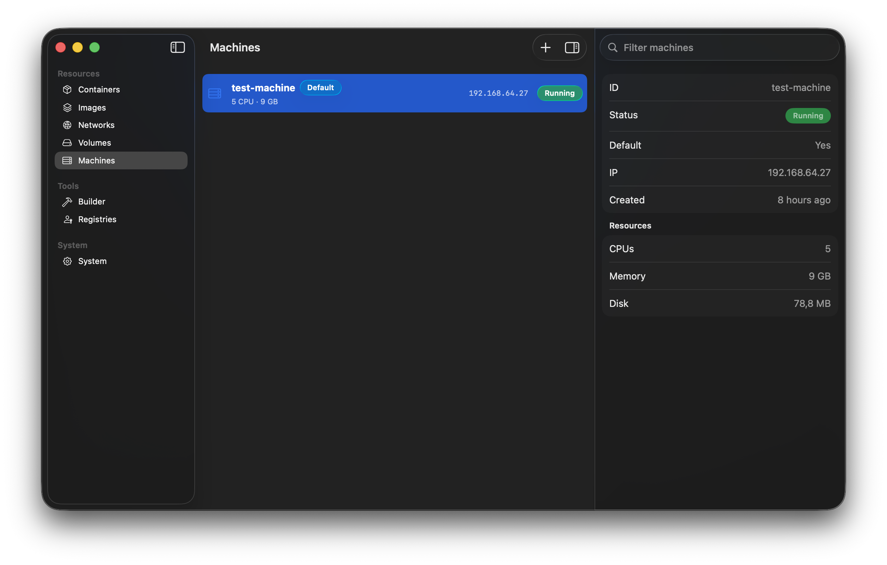
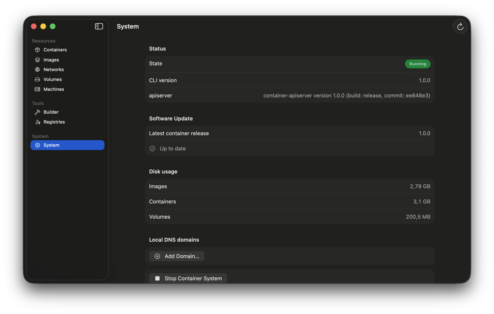
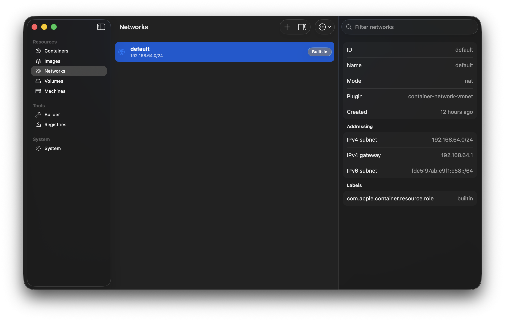
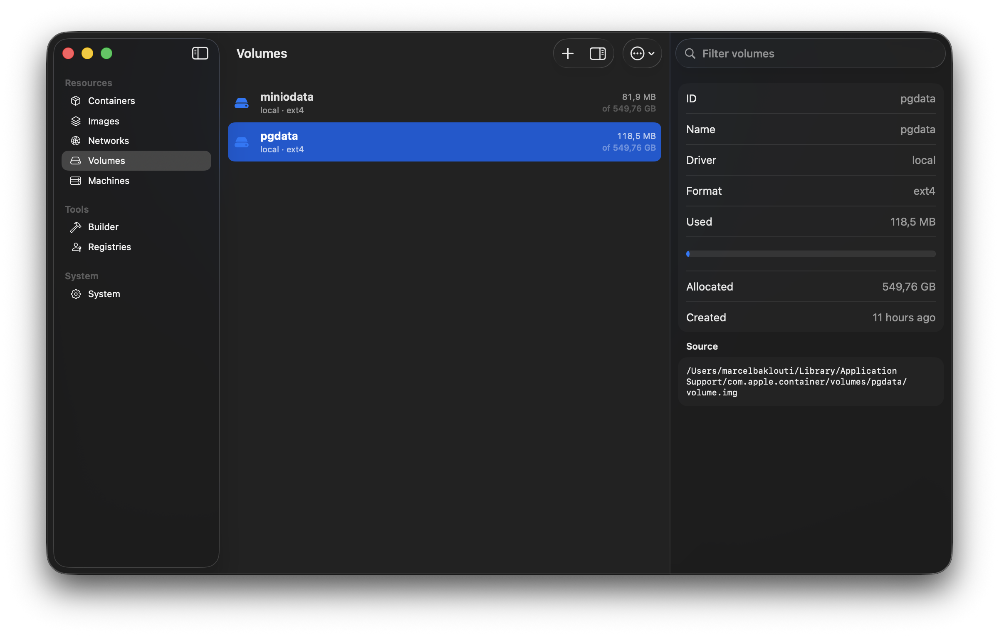
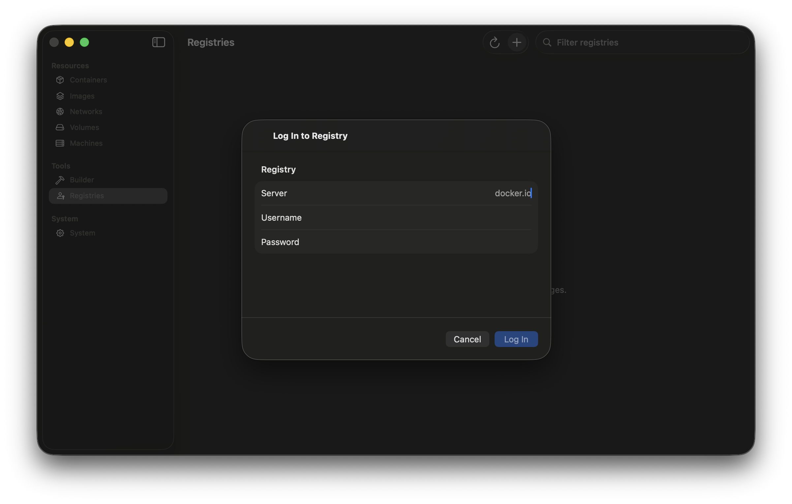
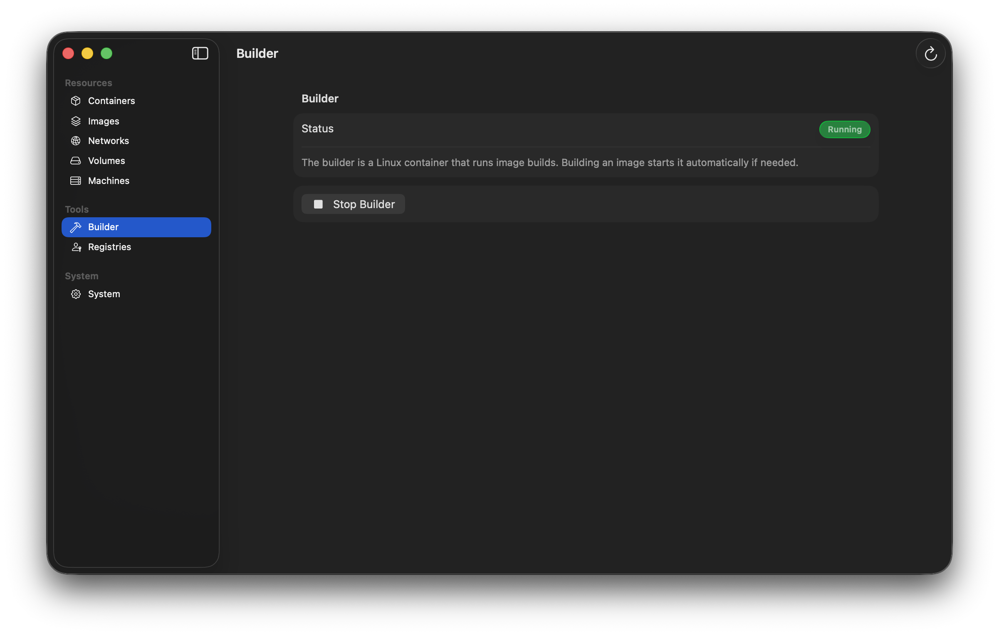

<div align="center">



# Container Desktop

**The Apple container GUI for your Mac.**

A native macOS app for [Apple's `container` runtime](https://github.com/apple/container) — run, inspect, and manage containers, images, volumes, networks, and machines, launch Compose stacks, and watch live stats, all from a clean SwiftUI app.


[](https://github.com/marcelbaklouti/container-desktop/releases/latest)

</div>

<p align="center">
  
</p>

## Why Container Desktop

Apple's `container` runtime is fast and native, but it ships as a command-line tool. Container Desktop is the graphical surface it doesn't have — a real SwiftUI app (no Electron) that drives the same `container` CLI you already use, so everything you do in the app matches the terminal exactly.

- **Native, not a wrapper** — SwiftUI + Liquid Glass, light and instant.
- **Launch Compose stacks** — open a `docker-compose.yml` and run the whole thing: named volumes, a project network, dependency order, per-service progress, grouped by project.
- **Live stats & menu bar** — real-time CPU and memory on every container, per-project totals, and a menu-bar summary that's always a click away.
- **Logs, a real terminal & file copy** — follow logs, open a shell inside any container, and copy files in and out.
- **Images, end to end** — pull, build from a Dockerfile with live output, tag, push, import/export `.tar`, view history, and prune.
- **Everything else** — networks, volumes with real on-disk usage, Linux machines with a shell, registries, the builder, and container hostnames over local DNS.
- **Guided setup & verified updates** — missing the `container` CLI? It installs Apple's signed release for you, and the app updates itself — only ever accepting packages signed and notarized by Apple.

## Screenshots

| | |
| --- | --- |
|  |  |
| **Containers** — grouped by Compose project, live stats, inspector | **Images** — pull, build, push, import/export, history |
|  |  |
| **Machines** — the Linux VMs, with a shell | **System** — daemon, DNS domains, disk usage, updates |
|  |  |
| **Networks** | **Volumes** — with real on-disk usage |
|  |  |
| **Registries** | **Builder** |

## Requirements

- **Apple Silicon** Mac
- **macOS 26 Tahoe** or later
- Apple's [`container`](https://github.com/apple/container) CLI (1.0.0+) — Container Desktop can install and update it for you

## Install

1. Download the latest **`.dmg`** from the [Releases page](https://github.com/marcelbaklouti/container-desktop/releases/latest).
2. Drag **Container Desktop** to your Applications folder and open it.
3. On first launch, if the `container` CLI isn't installed, Container Desktop offers to download and install Apple's official, signed release for you (with an administrator prompt). Then start the container system from the app or the menu bar.

## Not affiliated with Apple

Container Desktop is an independent, open-source project and is **not affiliated with, endorsed by, or sponsored by Apple Inc.** Apple, macOS, and Apple Silicon are trademarks of Apple Inc. The app is native in look and feel but does not use Apple's logo or trade dress.

## License

[Apache License 2.0](LICENSE).

---

## For contributors

The app is a hand-maintained `Containers.xcodeproj` (Xcode 26.6, Swift 6, macOS 26 target). The landing page lives in [`landing/`](landing/) (Next.js).

```sh
# Build the app (CLI)
xcodebuild -project Containers.xcodeproj -scheme Containers -configuration Debug build CODE_SIGNING_ALLOWED=NO
# Tests
xcodebuild test -project Containers.xcodeproj -scheme Containers -destination 'platform=macOS'
```

Planning and context documents:

- **`Projectplan.md`** — scope, architecture, locked decisions, the CLI-to-feature mapping. Reference only.
- **`buildphases.md`** — the dependency-ordered execution checklist.
- **`Memory.md`** — living context: locked decisions, conventions, runtime facts, status. Read first, update last.

### References

- Apple container: [repo](https://github.com/apple/container) · [releases](https://github.com/apple/container/releases) · [CLI reference](https://github.com/apple/container/blob/main/docs/command-reference.md) · [technical overview](https://github.com/apple/container/blob/main/docs/technical-overview.md)
- [SwiftTerm](https://github.com/migueldeicaza/SwiftTerm) (embedded PTY) · [Swift Charts](https://developer.apple.com/documentation/charts) · [Observation](https://developer.apple.com/documentation/observation)
- [Developer ID & notarization](https://developer.apple.com/developer-id/) · [create-dmg](https://github.com/create-dmg/create-dmg)
